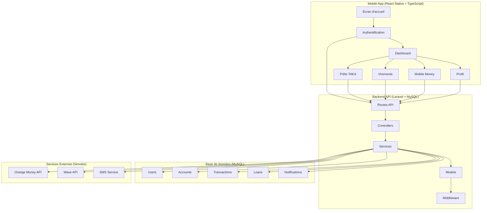

# 🏗️ Architecture - My Baobab Clone

## Vue d'ensemble du système



## 📱 Architecture Mobile (React Native)

### Structure des dossiers
```
mobile/
├── src/
│   ├── components/          # Composants réutilisables
│   │   ├── common/         # Composants génériques
│   │   ├── forms/          # Composants de formulaires
│   │   └── ui/             # Composants UI (boutons, inputs)
│   ├── screens/            # Écrans de l'application
│   │   ├── auth/           # Authentification
│   │   ├── dashboard/      # Tableau de bord
│   │   ├── loans/          # Prêts TAKA
│   │   ├── transfers/      # Virements
│   │   ├── mobile-money/   # Mobile Money
│   │   └── profile/        # Profil utilisateur
│   ├── navigation/         # Configuration de navigation
│   ├── store/              # État global (Redux)
│   │   ├── slices/         # Slices Redux
│   │   └── middleware/     # Middleware personnalisé
│   ├── services/           # Services API
│   ├── utils/              # Utilitaires
│   ├── hooks/              # Hooks personnalisés
│   ├── theme/              # Thème et couleurs
│   ├── assets/             # Images, icônes, polices
│   └── types/              # Types TypeScript
├── android/                # Configuration Android
├── ios/                    # Configuration iOS
└── __tests__/              # Tests
```

### Flux de données
1. **Authentification** : JWT stocké dans Keychain
2. **État global** : Redux Toolkit avec persistance
3. **API calls** : Axios avec intercepteurs
4. **Navigation** : React Navigation avec authentification guards
5. **Notifications** : React Native Push Notifications

## 🔧 Architecture Backend (Laravel)

### Structure des dossiers
```
backend/
├── app/
│   ├── Http/
│   │   ├── Controllers/
│   │   │   ├── Auth/           # Authentification
│   │   │   ├── Account/        # Gestion des comptes
│   │   │   ├── Transaction/    # Transactions
│   │   │   ├── Loan/           # Prêts TAKA
│   │   │   ├── Transfer/       # Virements
│   │   │   ├── MobileMoney/    # Mobile Money
│   │   │   └── Profile/        # Profil utilisateur
│   │   ├── Middleware/         # Middleware personnalisé
│   │   ├── Requests/           # Validation des requêtes
│   │   └── Resources/          # Transformation des réponses
│   ├── Models/                 # Modèles Eloquent
│   ├── Services/               # Logique métier
│   │   ├── Auth/               # Services d'authentification
│   │   ├── Payment/            # Services de paiement
│   │   ├── Loan/               # Services de prêt
│   │   ├── MobileMoney/        # Simulateurs Mobile Money
│   │   └── Notification/       # Services de notification
│   ├── Repositories/           # Couche d'accès aux données
│   └── Exceptions/             # Gestion des exceptions
├── database/
│   ├── migrations/             # Migrations de base de données
│   ├── seeders/                # Données de test
│   └── factories/              # Factories pour les tests
├── routes/
│   ├── api.php                 # Routes API
│   └── web.php                 # Routes web (admin)
├── config/                     # Configuration
├── storage/                    # Stockage (logs, cache)
└── tests/                      # Tests unitaires et d'intégration
```

### Patterns utilisés
- **Repository Pattern** : Abstraction de l'accès aux données
- **Service Layer** : Logique métier séparée des controllers
- **Resource Pattern** : Transformation des réponses API
- **Observer Pattern** : Événements et listeners
- **Strategy Pattern** : Différents fournisseurs Mobile Money

## 🗄️ Architecture Base de données

### Schéma principal
```sql
-- Utilisateurs
users (id, phone, email, password, email_verified_at, phone_verified_at, created_at, updated_at)

-- Profils utilisateurs
user_profiles (id, user_id, first_name, last_name, date_of_birth, address, id_number, created_at, updated_at)

-- Comptes bancaires
accounts (id, user_id, account_number, account_type, balance, currency, status, created_at, updated_at)

-- Transactions
transactions (id, account_id, type, amount, currency, description, reference, status, metadata, created_at, updated_at)

-- Prêts TAKA
loans (id, user_id, amount, interest_rate, duration_months, monthly_payment, status, disbursed_at, due_date, created_at, updated_at)

-- Remboursements de prêts
loan_repayments (id, loan_id, amount, due_date, paid_date, status, created_at, updated_at)

-- Virements
transfers (id, from_account_id, to_account_id, amount, currency, description, reference, status, fees, created_at, updated_at)

-- Transactions Mobile Money
mobile_money_transactions (id, user_id, provider, phone_number, amount, type, reference, status, created_at, updated_at)

-- Notifications
notifications (id, user_id, type, title, message, data, read_at, created_at, updated_at)

-- Sessions d'authentification
personal_access_tokens (id, tokenable_type, tokenable_id, name, token, abilities, last_used_at, created_at, updated_at)
```

## 🔒 Sécurité

### Mobile
- **Keychain** : Stockage sécurisé des tokens
- **Biométrie** : Authentification par empreinte/Face ID
- **Certificate Pinning** : Protection contre les attaques MITM
- **Code Obfuscation** : Protection du code source

### Backend
- **JWT Authentication** : Tokens sécurisés avec expiration
- **Rate Limiting** : Protection contre les attaques par force brute
- **CORS** : Configuration stricte des origines autorisées
- **Validation** : Validation stricte de toutes les entrées
- **Encryption** : Chiffrement des données sensibles
- **Audit Logs** : Traçabilité de toutes les actions

## 🚀 Déploiement Local

### Environnement de développement
1. **Backend** : Laravel Sail (Docker) ou serveur local
2. **Base de données** : MySQL via Docker ou installation locale
3. **Mobile** : Metro bundler + simulateurs iOS/Android
4. **Cache** : Redis (optionnel)
5. **Queue** : Database driver pour les jobs

### Configuration
- **Environment** : Fichiers .env séparés pour mobile et backend
- **API Base URL** : Configuration dynamique selon l'environnement
- **Database** : Migrations et seeders pour données de test
- **SSL** : Certificats auto-signés pour HTTPS local

## 📊 Monitoring et Logs

### Mobile
- **Crash Reporting** : React Native Flipper
- **Performance** : React Native Performance Monitor
- **Analytics** : Événements personnalisés

### Backend
- **Logs** : Laravel Log avec rotation
- **Monitoring** : Laravel Telescope (développement)
- **Performance** : Query logging et profiling
- **Health Checks** : Endpoints de santé de l'API

Cette architecture garantit une séparation claire des responsabilités, une sécurité robuste et une maintenabilité optimale pour le développement et l'évolution de l'application.

